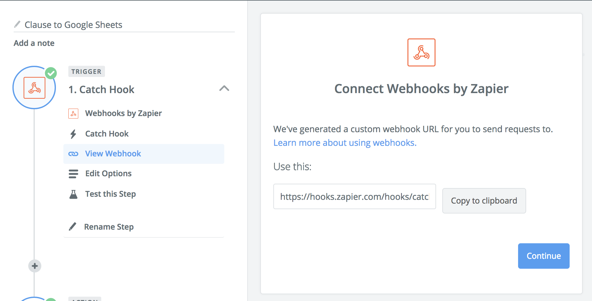
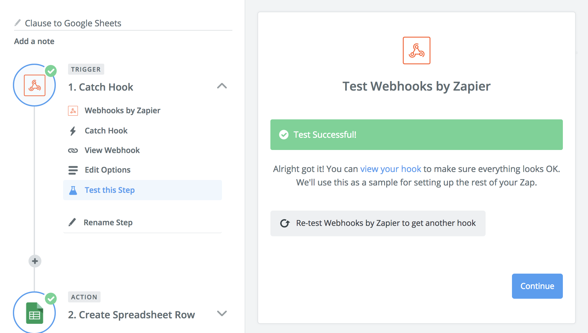
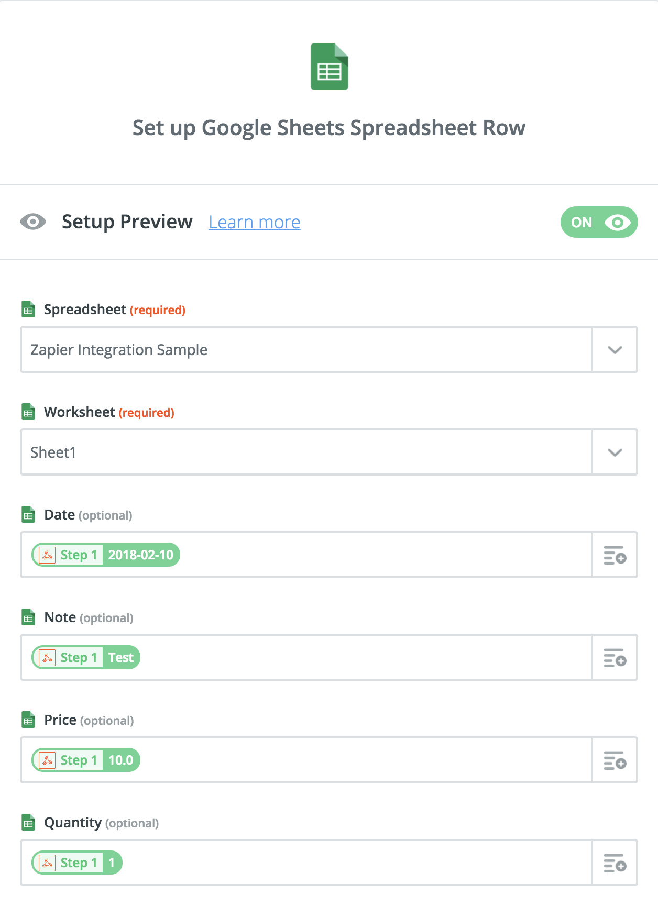

# HTTP Post Sample Clause

This sample clause demonstrates how to send data to an external URL. 

For example, we can use this clause to send data to a [Zapier Web Hook](https://zapier.com/apps/webhook/integrations) from where we can forward on a message to one of [many hundred other online services](https://zapier.com/apps/integrations).

This guide explains how to use Zapier to recieve a message from Clause and to add it to a row in a Google Sheets spreadsheet. This example can be completed with free accounts from Zapier and Google.

## Integrating Clause with Google Sheets

### Setting up your Contract

For illustration, we will use the following example data. We assume that this is generated by your application or Cicero template.

```js
const data = { 
    "date":"2018-02-10",
    "note":"my note",
    "quantity":1,
    "unitPrice":10.0
};
```

To have Clause call Zapier automatically, your Cicero template logic should have return type, `io.clause.outbound.physical.Http`. You should also set the response fields as follows.
```js
/**
 * ...
 * @param {io.clause.outbound.physical.Http} context.response - the response
 * @AccordClauseLogic
 */
function execute(context) {
    // ...
    var res = context.response;
    res.url = YOUR_ZAPIER_WEB_HOOK_URL;
    res.method = 'POST';
    res.body = JSON.stringify(data);
}

```

If testing your integration with the `integration-httppost` sample clause (for example via the Clause execution REST API), then you should send the following payload.
```json
{
    "$class": "io.clause.samples.integration.httppost.Request",
    "data": JSON.stringify(data);
};
```

### Creating a Zap on Zapier

[Create your zap](https://zapier.com/app/editor), and choose `Webhooks` as the trigger from the list of built-in apps.

Then when configuring your webhook, choose the `Catch Hook` option.


Zapier will generate a unique URL for your integration. You should use this in your contract code, so that Clause knows where to send your data. 

> i.e. replace `YOUR_ZAPIER_WEB_HOOK_URL` in the code above with the value in this field.



Sending a test message during setup of Zapier is crucial as this allows Zapier to know the format of messages it will recieve. It is recommended that you use the Clause `/execute` REST API to emit a test message.



Once successful you can use the Action editor to configure your connection to Google Sheets and to map the fields from your test message. You should choose `Create Spreadsheet Row` from the Google Sheets action wizard.

> Note. Your spreadsheet should already exist on Google Sheets before you try this step.



All done!

Now each time your clause executes, you will add a new row to your spreadsheet.